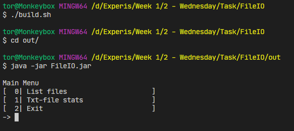
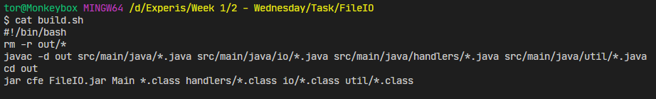

# Task 2 - "File System Manager"
A small project that lists files in a directory and displays stats about a text file.

## Project Structure
The program as been split up in classes that interact with the user (the `Main` class and `handlers` package), static methods that does the actual work (the classes in the `io` package) and the logging facility (in `util`). 

### The `Handler` interface
The UI is made up of classes that implement the `Handler` interface which provides a `handle()` method which is responsible for interacting with the user and turning those actions into method calls.

### The `io` package
The `io` package contains classes with static methods which does the actual work of the program. These methods are kept static as they do not
require any (shared) state to function. 

### The `util` package
The `util` package contains the `Logger` class which is an implementation of a logger that logs the duration of operations. The `Logger` expects a call to `prime(String key)` before a call to `log(String key, String out)` to record the start time of the operation. 
The Logger is implemented as a naive singleton (not thread safe)

## Compiling and running
Compiling and running the project:

Contents of `build.sh`:

Note that the jar must be executed in the out directory